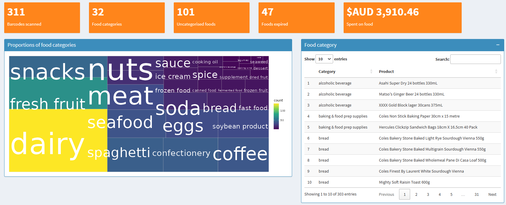
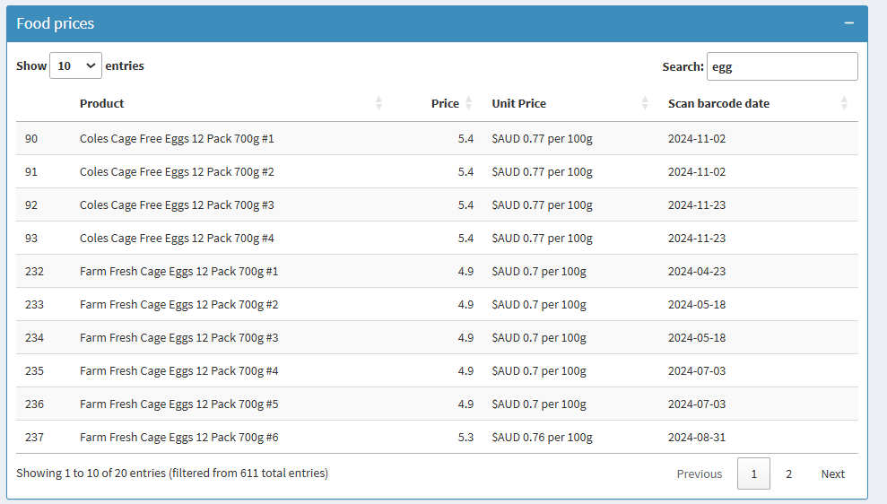

# R Shiny Dashboard: Data in Everyday Lives

## Introduction
This R Shiny app demonstrates how data insights can improve everyday life by tracking groceries, household item usage, and container recycling efforts. It features interactive dashboards for visualising trends, managing item usage, and reducing waste, all designed with user-friendly functionality to simplify daily tasks.

## Features

- **Household Item Usage**: Analyse trends in the use of everyday items to plan purchases effectively.
- **Grocery Tracking**: Keep track of grocery consumption and expiration dates to minimise waste.
- **Container Recycling**: Record and analyse recycling activities to support environmental sustainability.
- **Interactive Dashboards**: Built with Shiny's `tabPanel` for clear navigation and an intuitive user interface.
- **Data Visualisation**: Generate interactive and static visualisations using `ggplot2`, `plotly`, and `treemapify`.
- **Dynamic Tables**: Create interactive tables with sorting and filtering functionality using `DT`.

## Demo
You can view the live app here: [Data in Everyday Lives](https://luenhchang.shinyapps.io/data-in-everyday-lives/).

## Screenshots



---


---



---


---


---


## Technologies Used

- **Programming Language**: R  
- **Framework**: R Shiny  
- **Packages**:  
  - `shiny`: Core package for creating interactive web applications.  
  - `shinydashboard`: For enhanced dashboard layouts.  
  - `dplyr`: For efficient data manipulation and transformation.  
  - `ggplot2`: For creating static data visualisations.  
  - `plotly`: For interactive, web-based visualisations.  
  - `treemapify`: For treemap visualisations.  
  - `DT`: For interactive tables.  
  - `rmarkdown`: For generating reports directly from the app.  
  - `tidyverse`: For comprehensive data manipulation and visualisation.  
  - `magick`: For image handling and processing.  
- **Data Integration**: Integration with Google Sheets for seamless data management and reporting.

## How to Use

1. Clone the repository:  
   ```bash
   git clone  https://github.com/luenhchang/R_Shinyapp_data-in-everyday-lives.git
   ```

2. Install the required R packages:
```r
	install.packages(c("shiny", "shinydashboard", "dplyr", "ggplot2", "plotly", "treemapify", "DT", "rmarkdown", "tidyverse", "magick"))
```

## Update
**2025-01-24**:
* Added number of container collected or refunded in 2025 stacked bar plot using plotly

**2025-01-13**:
* Removed code for menuItem Fitness, Data Challenges, Job
* Created functions.R


